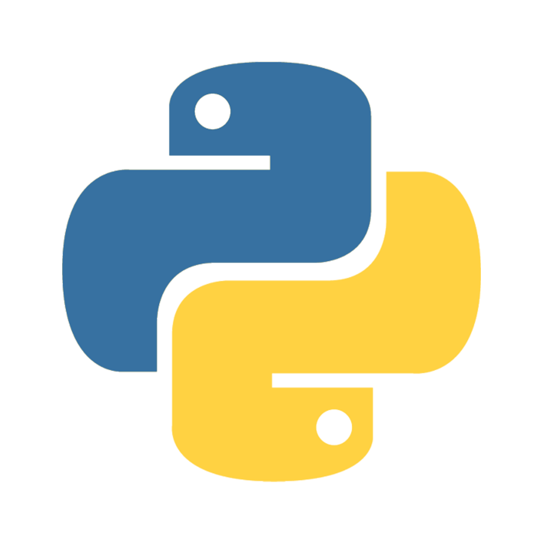

# RestHits Project

## Summary

RestHits is a simple REST API designed for managing songs (**hits**) and their respective **artists**. The project includes two main data models:

1. **Artist**:
   - Fields:
     - `id` (AutoField): Unique identifier for each artist.
     - `first_name` (CharField): The first name of the artist.
     - `last_name` (CharField): The last name of the artist.
     - `created_at` (DateTimeField): Timestamp indicating when the artist was added.

2. **Hit**:
   - Fields:
     - `id` (AutoField): Unique identifier for each hit.
     - `title` (CharField): The title of the song.
     - `artist_id` (ForeignKey): A reference to the associated artist.
     - `title_url` (CharField): A unique, slugified URL for the song.
     - `created_at` (DateTimeField): Timestamp indicating when the hit was created.
     - `updated_at` (DateTimeField): Timestamp indicating the last update to the hit.
     - `history` (HistoricalRecords): Tracks changes to the hit over time.

The API supports CRUD operations for both **artists** and **hits**, as well as endpoints for listing and retrieving data. It also includes a feature for populating the database with sample data for testing purposes.

The project uses Django and Django REST Framework, with PostgreSQL as the database backend. Historical data tracking is implemented using `django-simple-history`.

### Tech Stack
{ width=70px } { width=70px } { width=70px } 
---

### Endpoint overview

#### Hits
1. **`/api/v1/hits/`**
   - **GET**: Retrieve a list of the latest 20 hits.
   - **POST**: Create a new hit.

2. **`/api/v1/hits/<str:title_url>/`**
   - **GET**: Retrieve details of a specific hit by its `title_url`.
   - **PUT**: Update details of a specific hit by its `title_url`.
   - **DELETE**: Delete a specific hit by its `title_url`.

---

#### Artists
1. **`/api/v1/artists/`**
   - **GET**: Retrieve a list of all artists.
   - **POST**: Create a new artist.

2. **`/api/v1/artists/<int:pk>/`**
   - **GET**: Retrieve details of a specific artist by their `id`.
   - **DELETE**: Delete a specific artist by their `id`.

---

#### Populate Data (For Testing Only)
1. **`/api/v1/populate/`**
   - **GET**: Populate the database with sample artists and hits.


## Running the RestHits Project

### Run with Docker [Recommended]

1. Make sure docker is installed on your machine:
   - [Docker](https://www.docker.com/)


2. In the root directory of the project (where the `docker-compose.yml` file is located), run the following command:

   ```bash
   docker compose up --build
   ```

3. After the containers are built and running, the application will be available at: http://localhost:8000.

4. To stop the containers, use:
    ```bash
    docker compose down -v
    ```

### Run without Docker

1. Make sure you have Python & PostgreSQL installed
    - [Python](https://www.python.org/downloads/) or [Conda](https://anaconda.org/anaconda/conda)
    - [PostgreSQL](https://www.postgresql.org/download/)

2. Using **psql** or **pgAdmin** create database named 'resthits':
    ```sql
    CREATE DATABASE 'resthits';
    ```

3. In the **resthits/** directory:
    - (Optional, if using conda) Create virtual environment
        ```bash
        conda create -n resthits python==3.10.9
        ```
    - Install the dependencies
        ```bash
        pip install -r requirements.txt
        ```
        or
        ```bash
        conda install --yes --file requirements.txt
        ```
    - Create migrations:
        ```bash
        python manage.py makemigrations
        python mannage.py migrate
        ```
    - Run the development server:
        ```bash
        python manage.py runserver
        ```
    - (Optional) Run the unit tests:
        ```bash
        python manage.py test api.v1.tests.views_test
        python manage.py test api.v1.tests.models_test
        python manage.py test api.v1.tests.serializers_test
        ```
4. The application should be running on http://localhost:8000/api/v1/
